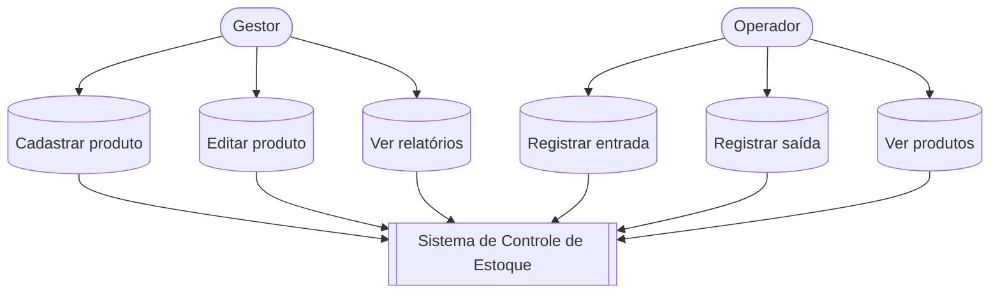
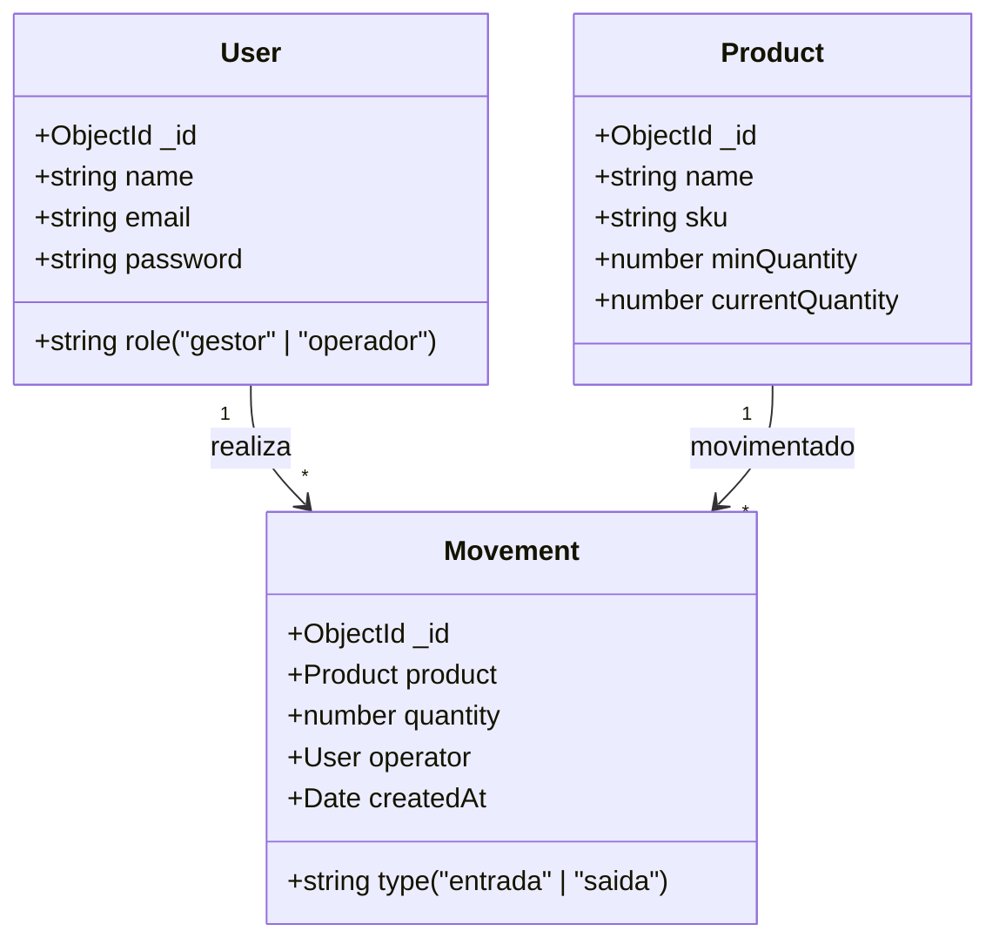
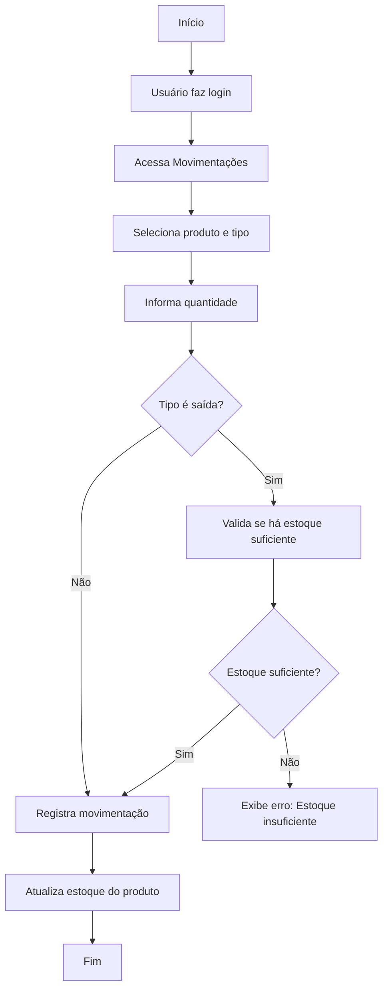

# Sistema de Controle de Estoque - Almoxarifado Central Ltda.

## 📋 Documentação do Projeto

### 🎯 **Escopo do Projeto**

**MVP (Mínimo Produto Viável):**
- ✅ Sistema de autenticação simples com JWT
- ✅ Cadastro e listagem de produtos
- ✅ Controle de estoque mínimo
- ✅ Registro de entradas e saídas
- ✅ Dashboard básico com alertas
- ✅ Dois tipos de usuário: Gestor e Operador

### 🛠 **Análise de Recursos**

**Recursos Humanos:**
- **1 Desenvolvedor Full-Stack Júnior** - Implementação completa

**Tecnologias Utilizadas:**
- **Frontend:** Next.js 14 + TypeScript
- **Backend:** Next.js API Routes
- **Banco:** MongoDB + Mongoose
- **Autenticação:** JWT + Bcrypt
- **Estilização:** CSS puro (sem frameworks)

**Infraestrutura:**
- Desenvolvimento local
- MongoDB local
- Git para versionamento

### 🎯 **Objetivo**

**Problema do Cliente:**
- Controle de estoque em planilhas
- Erros frequentes de lançamento
- Falta de produtos quando necessário
- Dificuldade em saber o que comprar

**Solução:**
Sistema web simples que oferece:
- Controle em tempo real do estoque
- Alertas visuais de estoque baixo
- Histórico de movimentações
- Interface fácil para usuários não técnicos

### 📋 **Requisitos Funcionais**

**RF01 - Autenticação**
- RF01.1: Login com email/senha
- RF01.2: Dois perfis: Gestor (admin) e Operador
- RF01.3: Logout automático

**RF02 - Gestão de Produtos**
- RF02.1: Cadastrar produtos (nome, SKU, estoque mínimo)
- RF02.2: Listar todos os produtos
- RF02.3: Alertar estoque abaixo do mínimo
- RF02.4: Apenas gestores podem cadastrar/editar

**RF03 - Movimentações**
- RF03.1: Registrar entrada no estoque
- RF03.2: Registrar saída do estoque
- RF03.3: Validar saldo antes de saída
- RF03.4: Histórico com data e responsável

**RF04 - Dashboard**
- RF04.1: Total de produtos cadastrados
- RF04.2: Produtos com estoque baixo
- RF04.3: Estoque total disponível

### 🚀 **Requisitos Não-Funcionais**

**RNF01 - Desempenho**
- Carregamento em menos de 3 segundos
- Suporte a 50 produtos e 1000 movimentações

**RNF02 - Segurança**
- Senhas criptografadas
- Tokens JWT para sessões
- Validação básica de dados

**RNF03 - Usabilidade**
- Interface simples e intuitiva
- Navegação fácil entre telas
- Feedback visual das ações

**RNF04 - Confiabilidade**
- Backup manual do MongoDB
- Sistema funciona offline (exceto login)

### 📊 **Diagramas**

#### Diagrama de Casos de Uso


#### Diagrama de Classes


#### Fluxo de Movimentação


### 🎨 **Prototipagem**

#### Figma:
[Protótipos](https://www.figma.com/design/zaL1U95K7PtMpc8BT72kTS/Estoque?node-id=1-186&t=jNGUpN6rsWZ7dyui-1)

### ⚠️ **Análise de Riscos**

| Risco | Probabilidade | Impacto | Mitigação |
|-------|---------------|---------|-----------|
| Perda de dados do MongoDB | Baixa | Alto | Backup manual semanal |
| Erro no cálculo de estoque | Média | Alto | Validações no front e back |
| Usuário esquece senha | Alta | Baixo | Implementar "esqueci senha" na v2 |
| Lentidão com muitos dados | Baixa | Médio | Otimizar consultas quando necessário |
| Acesso não autorizado | Média | Alto | Validação de tokens JWT |

### 📁 **Estrutura do Projeto**
```
src/
├─ app/
│  ├─ api/
│  │  ├─ auth/
│  │  │  ├─ login/
│  │  │  │  └─ route.ts
│  │  │  └─ register/
│  │  │     └─ route.ts
│  │  ├─ movements/
│  │  │  └─ route.ts
│  │  └─ products/
│  │     └─ route.ts
│  ├─ dashboard/
│  │  └─ page.tsx
│  ├─ login/
│  │  └─ page.tsx
│  ├─ movements/
│  │  └─ page.tsx
│  ├─ products/
│  │  └─ page.tsx
│  ├─ register/
│  │  ├─ page.tsx
│  │  ├─ favicon.ico
│  │  ├─ globals.css
│  │  ├─ layout.tsx
│  │  └─ page.module.css
├─ components/
│  ├─ Header.tsx
│  ├─ MovementForm.tsx
│  ├─ ProductForm.tsx
│  └─ ProductList.tsx
├─ lib/
│  ├─ auth.ts
│  └─ dbConnect.ts
└── models/
    ├── Movement.ts
    ├── Product.ts
    └── User.ts
```

### 🚀 **Como Usar**

1. **Instalação:**
```bash
npm install
```

2. **Configuração:**
```bash
# .env.local
DATABASE_URL=mongodb://localhost:27017/formativa-sgm-castelloB
JWT_SECRET=MINHA_CHAVE_SECRETA
```

3. **Executar:**
```bash
npm run dev
```

4. **Primeiro Acesso:**
   - Acesse `/register`
   - Crie um usuário gestor
   - Comece cadastrando produtos

---
